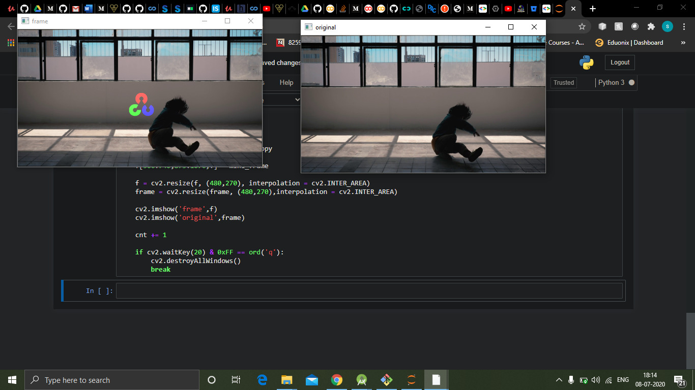

# Images-behind-objects-in-videos

The task was to insert images behind objects in videos without distorting the dynamics of objects inside the video.

 

Technology Stack 

=> Computer vision, numpy, matplotlib
